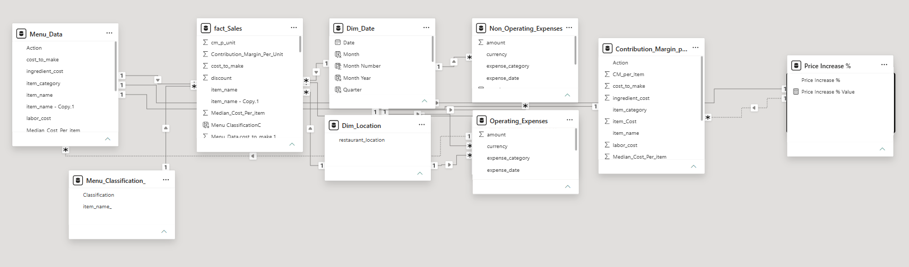
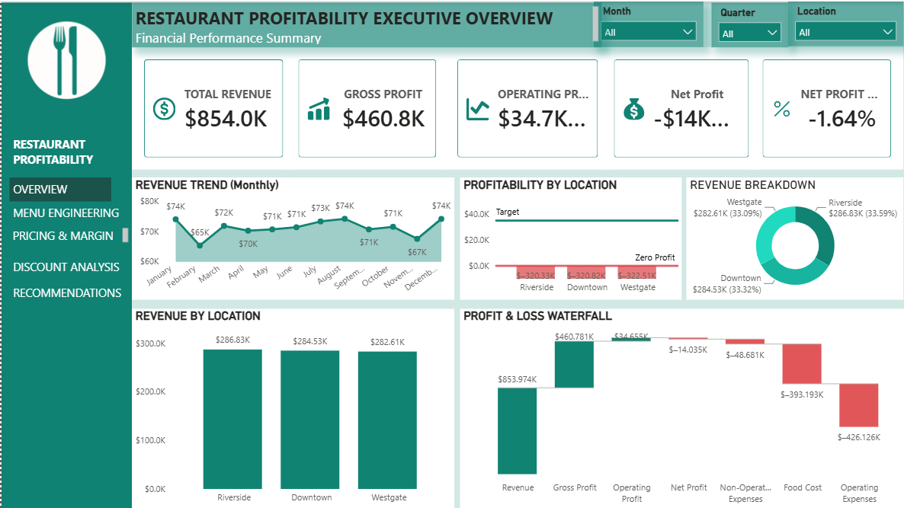
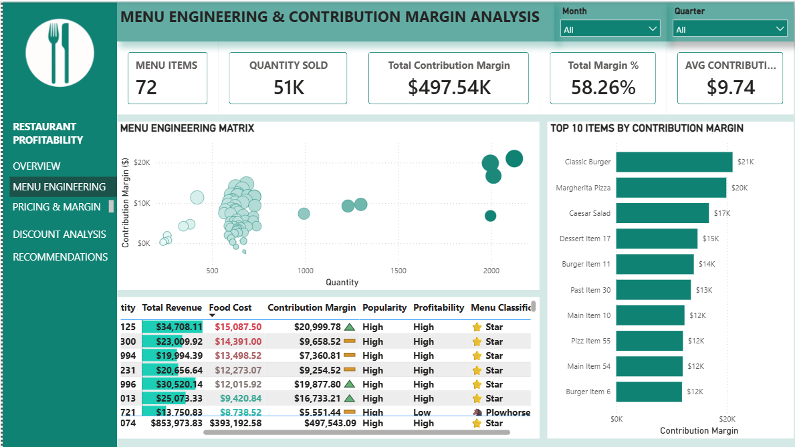
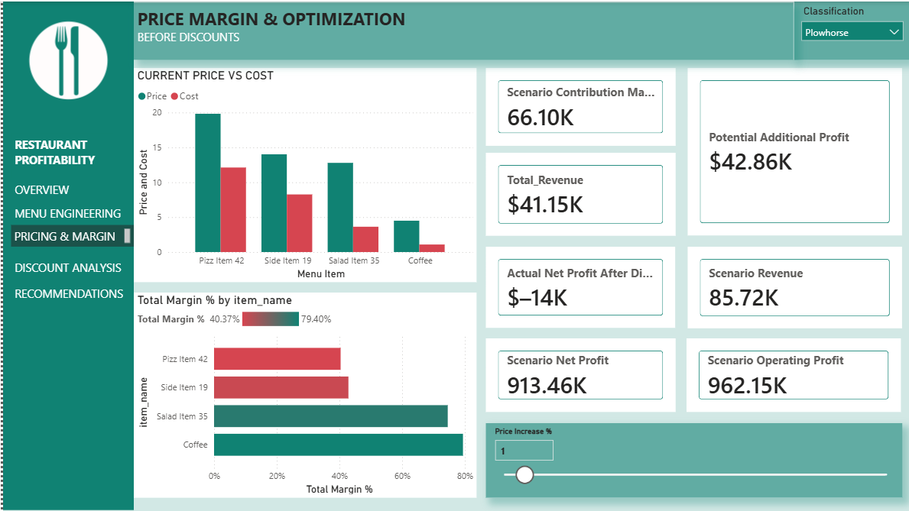
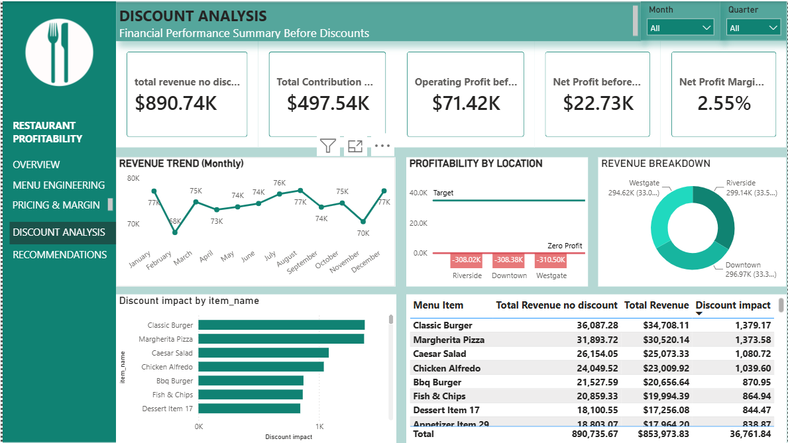
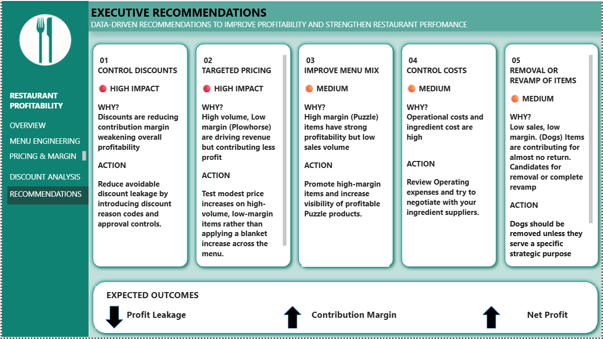

# Restaurant-Profitability-And-Menu-Engineering-Optimization
## **Project Overview** ##

An end-to-end data analytics project that analyzes restaurant sales and cost data to identify factors affecting profitability. Using menu engineering principles, contribution margin analysis, and pricing optimization, the project provides actionable recommendations to improve revenue and profit.

**Tools Used:** Power BI • DAX • SQL • Power Query • Excel

---

## **Business Problem** ##

Many restaurants generate strong sales revenue but still struggle to achieve healthy profits.

This project investigates the financial performance of a restaurant by identifying:

- High and low performing menu items
- Impact of discounts on profitability
- Contribution margin by product
- Location profitability
- Pricing opportunities
- Menu engineering classifications

The goal is to help management make data-driven decisions that improve profitability.

---

## **Objectives** ##

- Analyze restaurant revenue and profitability.
- Calculate contribution margin for every menu item.
- Evaluate the impact of discounts.
- Classify menu items using Menu Engineering.
- Identify pricing opportunities.
- Compare financial performance across locations.
- Develop executive dashboards for decision making.

---

## **Dataset** ##

The analysis uses transactional restaurant data consisting of:

- Sales Transactions
- Menu Items
- Food Costs
- Operating Expenses
- Discounts
- Restaurant Locations
- Calendar Data

The data model was structured using a star schema to support efficient reporting and DAX calculations.

## Data Model ##

Below is the star schema used to support the analysis.

A star schema was implemented to improve reporting performance and simplify relationships between the Sales fact table and supporting dimension tables including Menu, Calendar, and Operating Expenses.

---

## **Tools & Technologies** ##

| Tool        | Purpose                              |
| ----------- | ------------------------------------ |
| SQL         | Data extraction, Cleaning and business queries |
| Power Query | Data cleaning and transformation     |
| Power BI    | Dashboard development                |
| DAX         | Financial calculations and KPIs      |
| Excel       | Initial validation and data checks   |

---

## **Project Workflow** ##

Raw Data 
      ↓ 
Data Cleaning 
      ↓ 
SQL Analysis 
      ↓ 
Power BI Data Model 
      ↓ 
DAX Measures 
      ↓ 
Interactive Dashboards 
      ↓ 
Business Insights 
      ↓ 
Recommendations

## SQL Data Cleaning
- Removed duplicates
- Corrected data types
- Handled missing costs
- Standardized categories
- Duplicate removal

## SQL Analysis
- Contribution Margin calculations
- Revenue aggregation
- Revenue Analysis
- Profitability Analysis
- Menu Performance

## Power BI Data Models

Built relationships between:

- Sales
- Menu
- Operating Expenses
- Calendar
- Financial Measures

## DAX measures 
- Revenue
- Gross Profit
- Net Profit
- Contribution Margin
- Margin %
- Average Order Value
- Dashboard Development

Designed interactive dashboards for executives

---

## **Dashboard Overview** ##

### Executive Overview

Provides a high-level summary of revenue, gross profit, net profit, contribution margin, and restaurant performance.

---

### Menu Engineering

Classifies menu items into:

- ⭐ Stars
- 🐴 Plowhorses
- 🧩 Puzzles
- 🐕 Dogs

to support pricing and promotional decisions.

---

### Pricing Optimization

Analyzes pricing strategies and estimates the impact of potential price increases on contribution margin and profitability.

---

### Discount Analysis

Identifies the discount impact.

---

### Recommendations

Summarizes strategic recommendations based on the analysis.

---

## **KPIs** ##

## Key Performance Indicators

- Revenue
- Gross Profit
- Net Profit
- Contribution Margin
- Contribution Margin %
- Average Order Value
- Total Discounts
- Operating Expenses
- Profit by Location

---

## **KPIs** ##

## Key Insights

- Revenue remained strong despite declining profitability.
- Discounts significantly reduced overall profit.
- A small number of menu items generated the majority of contribution margin.
- Several popular products had relatively low profitability.
- Selected price adjustments could improve overall profit without affecting demand.
- Contribution margin analysis provided a more accurate measure of product profitability than gross profit alone.

---

## **Business Recommendations** ##

- Review the current discount policy.
- Increase prices selectively on high-demand items.
- Promote Star items to maximize profit.
- Re-engineer Plowhorse items by reducing food costs.
- Improve profitability monitoring using contribution margin.
- Review underperforming menu items regularly.

---

## **Business Impact** ##

The analysis demonstrates how restaurant management can improve financial performance by combining menu engineering, pricing optimization, and contribution margin analysis.

The recommendations support:

- Increased profitability
- Better pricing decisions
- Reduced revenue leakage
- Improved menu strategy
- Data-driven decision making

---

## **Skills Demonstrated** ##

- SQL
- Power BI
- DAX
- Power Query
- Data Modeling
- Financial Analysis
- Menu Engineering
- Pricing Strategy
- Dashboard Design
- KPI Development
- Business Storytelling
- Problem Solving

---

## **Repository Structure** ##

Restaurant-Profitability-Menu-Engineering/
│ 
├── README.md 
├── SQL/ 
├── Dashboard_Screenshots/ 
├── Dataset/ 
├── Documentation/ 
└── Restaurant_Profitability.pbix

---

## **Contact** ##

If you would like to discuss this project or connect professionally, feel free to reach out through my GitHub profile or LinkedIn.

